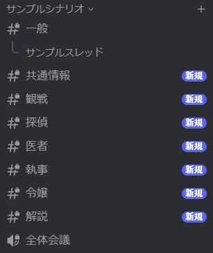
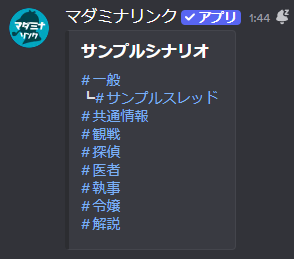
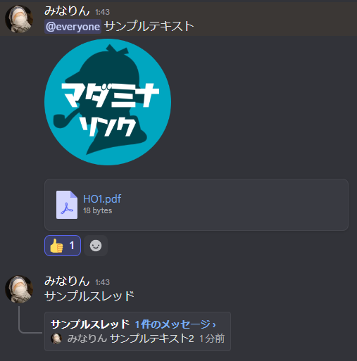
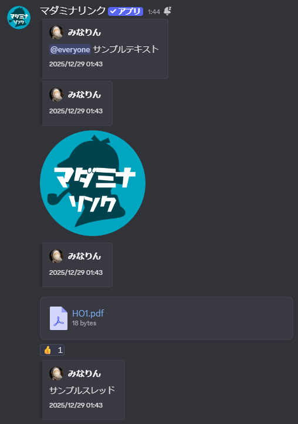

<PageHeader />

## 使用方法

```
/archive 保存するカテゴリ:#カテゴリ名
```

実行すると、指定したカテゴリ内のテキストチャンネルがスレッドに変換されて保存されます。保存先を指定しない場合、「ログ {カテゴリ名}」という名前のチャンネルが自動作成されます。

::: tip 処理時間について
メッセージ数に応じて処理に時間がかかります。完了までしばらくお待ちください。
:::

<div style="display: flex; gap: 1rem; flex-wrap: wrap; align-items: flex-start;">
  <figure style="flex: 1; min-width: 200px; max-width: 48%; margin: 0; text-align: center;">
    
    <figcaption>保存前</figcaption>
  </figure>
  <figure style="flex: 1; min-width: 200px; max-width: 48%; margin: 0; text-align: center;">
    
    <figcaption>保存後</figcaption>
  </figure>
</div>

::: warning 保存先チャンネルを削除しないでください
保存したログは保存先チャンネルのスレッドに格納されています。保存先チャンネルを削除すると、ログも一緒に消えてしまいます。
:::

## 保存される内容

メッセージの内容がそのままスレッドに保存されます。

<div style="display: flex; gap: 1rem; flex-wrap: wrap; align-items: flex-start;">
  <figure style="flex: 1; min-width: 250px; max-width: 48%; margin: 0; text-align: center;">
    
    <figcaption>元のメッセージ</figcaption>
  </figure>
  <figure style="flex: 1; min-width: 250px; max-width: 48%; margin: 0; text-align: center;">
    
    <figcaption>保存後のメッセージ</figcaption>
  </figure>
</div>

| 項目 | 保存される内容 |
|------|---------------|
| メッセージ | テキストメッセージ、埋め込み |
| 添付ファイル | 画像、PDF、その他ファイル（10MB以下） |
| リアクション | 絵文字とリアクション数 |
| スレッド | チャンネル内のスレッドとその中のメッセージ |
| メタ情報 | 投稿者名、アイコン、投稿日時 |

::: warning ファイルサイズの上限
10MBを超えるファイルは保存されません。
:::

## オプション

| オプション | 必須 | 説明 |
|-----------|------|------|
| 保存するカテゴリ | はい | 保存するカテゴリまたはテキストチャンネル |
| 保存先 | いいえ | 保存先のチャンネル |

### オプションの詳細

#### 保存するカテゴリ（必須）

保存対象のカテゴリまたはテキストチャンネルを指定します。

- **指定可能な対象**: カテゴリ、テキストチャンネル
- **カテゴリ指定時**: カテゴリ内のすべてのテキストチャンネルが保存対象になる
- **チャンネル指定時**: 指定したチャンネルのみが保存対象になる

#### 保存先

ログを保存するチャンネルを指定します。

- **デフォルト**: 「ログ {カテゴリ名}」という名前のチャンネルが自動作成される
- **指定可能な対象**: テキストチャンネル
- **権限**: 自動作成時は、保存対象カテゴリと同じ権限設定が適用される

::: tip ヒント
既存のログ保管用チャンネルに追加したい場合は、保存先を指定してください。
:::

## 使用例

### 基本的な使い方

```
/archive 保存するカテゴリ:#セッション用
```

カテゴリ内のすべてのテキストチャンネルをスレッド形式で保存します。

### 保存先を指定する場合

```
/archive 保存するカテゴリ:#セッション用 保存先:#ログ保管庫
```

指定したチャンネルにスレッドとしてログを保存します。複数のセッションのログを1つのチャンネルにまとめたい場合に便利です。

### 単一チャンネルを保存する場合

```
/archive 保存するカテゴリ:#雑談
```

カテゴリではなくテキストチャンネルを指定すると、そのチャンネルのみが保存されます。

## 用途

### セッション終了後のログ保存

セッションが終了したチャンネルのログを残しつつ、チャンネル数を削減したい場合に使用します。

1. セッションが終了したカテゴリを選択して `/archive` を実行
2. カテゴリ内の全チャンネルがスレッドとして保存される
3. 元のカテゴリは [/delete](/commands/delete) で削除

::: tip
ログを保存した後は、元のチャンネルを [/delete](/commands/delete) で削除するとチャンネル数を削減できます。
:::

### ログの集約管理

複数のセッションのログを1つのチャンネルにまとめて管理したい場合に使用します。

1. ログ保管用のチャンネルを作成（例: `#ログ保管庫`）
2. `/archive 保存するカテゴリ:#セッション1 保存先:#ログ保管庫` で保存
3. 別のセッションも同じ保存先を指定して保存

::: warning 権限について
1つのチャンネルにまとめると、そのチャンネルを見れる人は全てのログを閲覧できます。シナリオごとに閲覧権限を分けたい場合は、保存先を分けてください。
:::
