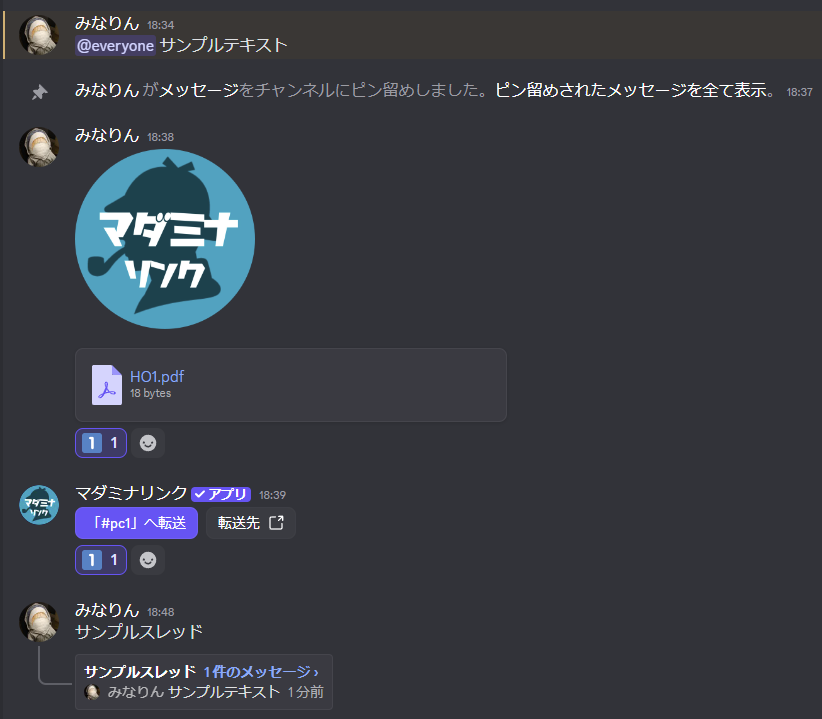
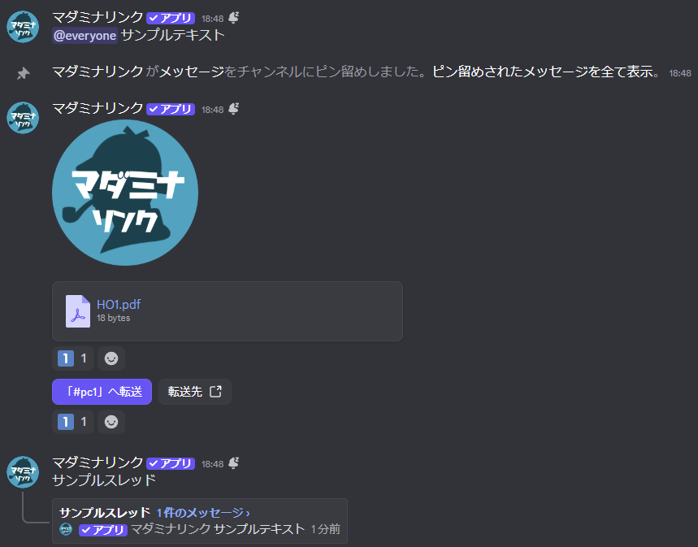

<PageHeader />

## 使用方法

```
/copy 対象:#セッション用
```

実行すると、指定したカテゴリとその中のすべてのチャンネルがコピーされ、名前の先頭に `(copy)` が付きます。

対象を指定せずに実行すると、コマンドを入力したチャンネルのみが複製されます。

```
/copy
```

メッセージ、画像、ファイル、ボタン、スレッドなどがすべてコピーされます。

<div style="display: flex; gap: 1rem; flex-wrap: wrap; align-items: flex-start;">
  <figure style="flex: 1; min-width: 300px; max-width: 48%; margin: 0; text-align: center;">
    
    <figcaption style="margin-top: 0.5rem; font-size: 0.9em; color: #666;">コピー前</figcaption>
  </figure>
  <figure style="flex: 1; min-width: 300px; max-width: 48%; margin: 0; text-align: center;">
    
    <figcaption style="margin-top: 0.5rem; font-size: 0.9em; color: #666;">コピー後</figcaption>
  </figure>
</div>

## 複製される内容

以下の設定とコンテンツが複製されます。

| 項目 | 複製される内容 |
|------|---------------|
| チャンネル設定 | 名前、権限設定、トピック、年齢制限、低速モード |
| メッセージ | テキストメッセージ、埋め込み、ボタン、添付ファイル |
| スレッド | アクティブなスレッドとその中のメッセージ |

カテゴリを複製した場合は、カテゴリの権限設定が引き継がれ、カテゴリ内のすべてのチャンネルが複製されます。

## オプション

| オプション | 必須 | 説明 |
|-----------|------|------|
| 対象 | いいえ | コピーするチャンネルまたはカテゴリ |
| メッセージを複製しない | いいえ | チャンネル構造のみ複製し、メッセージはコピーしない |

### オプションの詳細

#### 対象

複製したいチャンネルまたはカテゴリを指定します。

- **デフォルト**: コマンドを実行したチャンネル
- **指定可能な対象**: テキストチャンネル、カテゴリ
- **カテゴリを指定した場合**: カテゴリとその中のすべてのチャンネルが複製されます

#### メッセージを複製しない

チャンネル構造のみを複製するかどうかを選択します。

- **いいえ（デフォルト）**: メッセージ、ボタン、スレッドなどもすべて複製されます
- **はい**: チャンネルの設定と権限のみ複製され、メッセージは複製されません

## 使用例

### 現在のチャンネルを複製

```
/copy
```

コマンドを入力したチャンネルを複製します。メッセージもすべてコピーされます。

### 特定のカテゴリを複製

```
/copy 対象:#セッション用
```

カテゴリとその中のチャンネルをすべて複製します。

<!-- TODO: カテゴリ複製のスクリーンショット -->

### メッセージなしで複製

```
/copy 対象:#セッション用 メッセージを複製しない:はい
```

チャンネル構造のみを複製し、メッセージはコピーしません。テンプレートとして使いたい場合に便利です。

## 用途

### テンプレートカテゴリの活用

1. テンプレートとなるカテゴリを作成し、必要なチャンネル、権限、ピン留めメッセージなどを設定
2. 新しいセッションの際に `/copy` で複製
3. 複製されたカテゴリの名前を変更してセッションを開始

### 既存セッションの再利用

1. 過去のセッションカテゴリを `/copy` で複製
2. メッセージは自動的にコピーされるため、ルール説明やボタンなどがそのまま使える
3. 必要に応じて内容を更新

### 空のセッション環境を作成

1. テンプレートカテゴリを `/copy メッセージを複製しない:はい` で複製
2. チャンネル構造だけがコピーされ、メッセージは空の状態
3. まっさらな環境でセッションを開始できる

## 注意事項

::: warning 通知について
メッセージ複製時には通知が発生しないように設定されています。  
そのため、元のメッセージに@メンションが含まれていても、複製先では通知が送られません。
:::

::: warning チャンネル数の上限
サーバー全体のチャンネル数が500個を超える場合はエラーになります。
:::

::: tip ボタンの対象チャンネルについて
[/transfer](/commands/transfer) や [/open](/commands/open) で作成したボタンを複製する場合、ボタンが置いてあるチャンネルとボタンの対象となっているチャンネルの両方を同じカテゴリに入れてからコピーしてください。そうすることで、カテゴリ内のチャンネル参照が自動的に更新され、新しいチャンネルを指すようになります。
:::

## 関連コマンド

<RelatedCommands :commands="['setup', 'delete']" />
