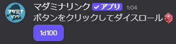
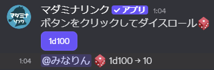
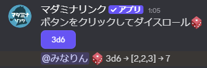

<PageHeader />

## 使用方法

```
/dice ダイスの数:X ダイスの面数:Y
```

実行すると、`XdY` のダイスボタンが作成されます。以下は1d100のダイスボタンを作成する例です。

```
/dice ダイスの数:1 ダイスの面数:100
```



## ダイスロールの仕組み

ボタンを押すと、チャンネルにダイスの結果が投稿されます。

- **単一ダイスの場合**: `1d100 → 10` のように出目が表示されます
- **複数ダイスの場合**: `3d6 → [2,2,3] → 7` のように各ダイスの出目と合計が表示されます

結果には実行者のメンションが付くため、誰がダイスを振ったか分かります。

<div style="display: flex; gap: 1rem; flex-wrap: wrap; align-items: flex-start;">
  <figure style="flex: 1; min-width: 200px; max-width: 48%; margin: 0; text-align: center;">
    
    <figcaption>単一ダイスの結果</figcaption>
  </figure>
  <figure style="flex: 1; min-width: 200px; max-width: 48%; margin: 0; text-align: center;">
    
    <figcaption>複数ダイスの結果</figcaption>
  </figure>
</div>

## オプション

| オプション | 必須 | 説明 |
|-----------|------|------|
| ダイスの数 | はい | ダイスの数 |
| ダイスの面数 | はい | ダイスの面数 |

### オプションの詳細

#### ダイスの数

振るダイスの個数を指定します。

- **指定可能な値**: 1〜100

#### ダイスの面数

ダイスの面数を指定します。

- **指定可能な値**: 2〜10,000

## 用途

### ケース1: セッション中のダイスロール

プレイヤーが自由にダイスを振れるようにします。

1. `/dice` でダイスボタンを設置
2. プレイヤーがボタンを押してダイスを振る
3. 結果がチャンネルに表示される

::: tip
複数のダイスボタンを設置することで、異なる種類のダイス（1d6、3d6、1d100など）を用意できます。
:::

### ケース2: ランダムイベントの決定

GMがランダムな展開を決定する際に使用します。

1. `/dice` でダイスボタンを設置
2. GMがボタンを押して結果を確認
3. 結果に応じてイベントを進行
