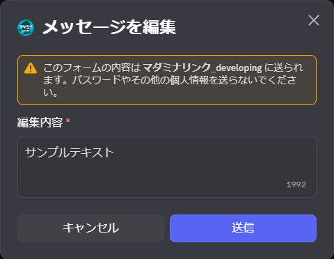

<PageHeader />

## 使用方法

1. 編集したいBotのメッセージを右クリック
2. 「アプリ」→「メッセージを編集」を選択
   
3. 編集用のモーダルが表示されます
   
4. 内容を編集して送信

::: warning Bot自身が送信したメッセージのみ編集可能です
他のユーザーやBotが送信したメッセージは編集できません。
:::

## 用途

### Botが送信したメッセージの修正

[/transfer](/commands/transfer)、[/copy](/commands/copy)、[/remind](/commands/remind) などでBotが送信したメッセージに誤字があった場合などに、後から修正できます。

### ボタンへの説明文追加

[/role](/commands/role)、[/dice](/commands/dice)、[/transfer](/commands/transfer) などで作成したボタンに説明文を追加できます。
