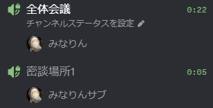
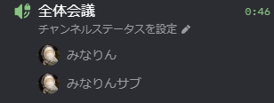
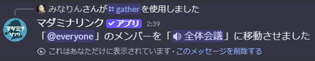

<PageHeader />

## 使用方法

```
/gather
```

実行すると、サーバー内の他のVCに参加しているメンバーを、自分がいるVCに移動させます。

複数のVCにメンバーが分かれている状態から、



全員を同じVCに集合させることができます。



実行が完了すると、移動させたロールとVC名が表示されます。



::: warning 実行条件
GMがVCに参加していない状態では使用できません。必ずVCに入ってから実行してください。
:::

## オプション

| オプション | 必須 | 説明 |
|-----------|------|------|
| 対象 | いいえ | 移動対象を特定のロールに限定する |

### オプションの詳細

#### 対象

移動対象を特定のロールに限定します。

- **デフォルト**: @everyone（VCに参加している全メンバー）
- **指定可能な対象**: ロール

::: tip ヒント
閲覧権限がないチャンネルにいるメンバーも強制的に移動させることができます。
:::

## 使用例

### 全員を集める

```
/gather
```

サーバー内の他のVCにいる全メンバーを、GMがいるVCに移動させます。

### 特定のロールのメンバーだけを集める

```
/gather 対象:@プレイヤー
```

指定したロールを持つメンバーのみを移動させます。GMや観戦者は移動せず、プレイヤーだけを集めたい場合に使用します。

## 用途

### ケース1: 密談から全体会議に戻す

密談用VCに分かれたメンバーを、全体会議用VCに呼び戻します。

1. GMが全体会議用のVCに移動する
2. `/gather` を実行する
3. 他のVCにいたメンバー全員がGMのいるVCに移動する

### ケース2: プレイヤーだけを集める

観戦者やGMを除き、プレイヤーだけを集めます。

1. GMが集合先のVCに移動する
2. `/gather 対象:@プレイヤー` を実行する
3. プレイヤーロールを持つメンバーのみがGMのいるVCに移動する

観戦者は別VCに残したまま進行したい場合に便利です。
