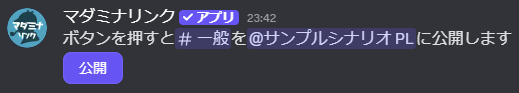
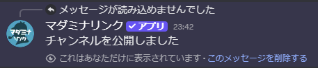

<PageHeader />

## 使用方法

```
/open 公開相手:@ロール名
```

実行すると、指定したロールまたはメンバーに対してチャンネルを公開するボタンが作成されます。

ボタンを押すまで、対象のチャンネルは公開相手から見えなくなります。



## 公開の仕組み

`/open` コマンドを実行すると、以下の2つの処理が行われます。

1. **チャンネルを非表示に設定**: 公開相手のロール/メンバーに対して「チャンネルを見る」権限が無効化されます
2. **公開ボタンを作成**: ボタンを押すと「チャンネルを見る」権限が有効化され、チャンネルが見えるようになります



## オプション

| オプション | 必須 | 説明 |
|-----------|------|------|
| 公開相手 | はい | チャンネルを公開するロールまたはメンバー |
| チャンネル | いいえ | 公開するチャンネル |

### オプションの詳細

#### 公開相手

チャンネルを公開する対象を指定します。

- **指定可能な対象**: ロール、メンバー
- **権限設定**: コマンド実行時に「チャンネルを見る」権限が無効化され、ボタンを押すと有効化されます

#### チャンネル

公開するチャンネルを指定します。

- **デフォルト**: コマンドを実行したチャンネル
- **指定可能なチャンネル**: テキストチャンネル、ボイスチャンネルなど（権限設定が可能なチャンネル）

::: tip ヒント
チャンネルを指定せずに実行すると、コマンドを実行したチャンネルが対象になります。
:::

## 使用例

### 現在のチャンネルを公開

```
/open 公開相手:@プレイヤー
```

コマンドを実行したチャンネルを、プレイヤーロールに対して公開するボタンを作成します。


### 特定のチャンネルを公開

```
/open 公開相手:@プレイヤー チャンネル:#秘密の部屋
```

別のチャンネル（#秘密の部屋）を公開するボタンを作成します。GMチャンネルから他のチャンネルを管理する場合に便利です。

### 特定のメンバーのみに公開

```
/open 公開相手:@ユーザー名 チャンネル:#個別情報
```

ロールではなく特定のメンバーに対してチャンネルを公開できます。個別の情報を渡す際に使用します。

## 用途

### ケース1: 全員に公開するチャンネル

PLロール全員に対してチャンネルを公開します。

1. 公開したいチャンネルを事前に作成
2. `/open 公開相手:@PL チャンネル:#真相` でボタンを作成
3. GMチャンネルにボタンを設置しておく
4. ゲーム中の適切なタイミングでボタンを押してチャンネルを公開

**公開例**: 追加情報チャンネル、エンディングチャンネル、真相チャンネル

**複数チャンネルを一斉公開する場合**: 複数のボタンを作成しておき、セッション開始時や特定のタイミングでまとめて押すことで一斉公開できます。

::: tip テンプレートカテゴリの再利用
テンプレートカテゴリに`/open`ボタンを設置しておき、[/copy](/commands/copy)でカテゴリを複製すると便利です。ボタンが設置されているチャンネルとボタンの対象チャンネルの両方が同じカテゴリ内にあれば、ボタンの対象が自動的に複製後のチャンネルに更新されます。
:::

### ケース2: 特定のメンバーのみに公開するチャンネル

特定のプレイヤーのみに情報を公開します。

1. 個別情報用のチャンネルを作成
2. `/open 公開相手:@メンバー名 チャンネル:#個別情報` を実行
3. 適切なタイミングでボタンを押す
4. 指定したメンバーのみがチャンネルを閲覧できるようになる

**使用例**: 個別エンディング、キャラクター固有の秘密
