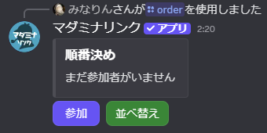
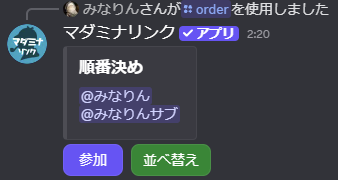
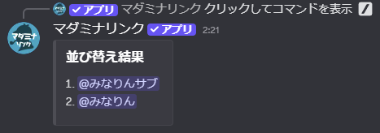

<PageHeader />

## 使用方法

```
/order
```

実行すると、「順番決め」という埋め込みメッセージが作成され、「参加」ボタンと「並べ替え」ボタンが表示されます。



## 順番決めの流れ

### 1. 参加者を集める

コマンド実行後、参加者は「参加」ボタンを押してリストに追加されます。



::: tip
同じユーザーが複数回ボタンを押しても重複して追加されません。
:::

### 2. 並べ替えを実行

参加者が揃ったら、「並べ替え」ボタンを押して順番を決定します。結果は番号付きで表示されます。



::: warning 実行者のみ
「並べ替え」ボタンはコマンドを実行したユーザーのみが押せます。
:::

## オプション

| オプション | 必須 | 説明 |
|-----------|------|------|
| ユーザーまたはロール | いいえ | 初期メンバーとして追加するユーザーやロール |
| ボイスチャンネル | いいえ | 指定したボイスチャンネルにいるメンバーを追加 |

### オプションの詳細

#### ユーザーまたはロール

初期メンバーを指定します。メンション形式で入力してください。

- **デフォルト**: 未指定（参加ボタンでメンバーを集める）
- **指定可能な対象**: ユーザーメンション（`@ユーザー名`）、ロールメンション（`@ロール名`）
- **複数指定**: 可能（スペース区切り）

ロールを指定した場合、そのロールを持つすべてのメンバーが初期メンバーとして追加されます。

#### ボイスチャンネル

指定したボイスチャンネルに接続しているメンバーを初期メンバーとして追加します。

- **デフォルト**: 未指定
- **指定可能な対象**: ボイスチャンネルのみ

## 使用例

### 参加ボタンで集める

```
/order
```

参加ボタンが表示され、押したメンバーがリストに追加されます。全員揃ったら並べ替えボタンで順番を決定します。

### ロールで初期メンバーを指定

```
/order ユーザーまたはロール:@プレイヤー
```

指定したロールを持つメンバーが初期メンバーとして追加された状態で開始します。

### ボイスチャンネルのメンバーを追加

```
/order ボイスチャンネル:#全体会議
```

指定したボイスチャンネルに接続しているメンバーが初期メンバーとして追加されます。

### 複数のオプションを組み合わせる

```
/order ユーザーまたはロール:@プレイヤー @GM ボイスチャンネル:#全体会議
```

ロール、個別ユーザー、ボイスチャンネルのメンバーをすべて初期メンバーとして追加します。

## 用途

### ケース1: 行動順の決定

戦闘やイベントでの行動順を決めます。

**例**: 調査の順番、ターン制の行動順、推理発表順

### ケース2: 役職・役割の割り当て

プレイヤーに役職や役割を割り当てる際の選択順を決めます。

**例**: 担当キャラクターの選択順、チーム分け
