<PageHeader />

## キャラ選択

### 使用方法

```
/poll 投票モード:キャラ選択 選択肢:探偵 医者 執事 令嬢
```

実行すると、選択肢ごとのボタンと「確認」「集計」ボタンが表示されます。

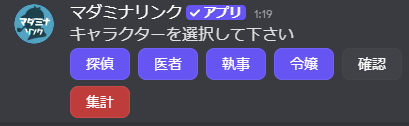

### 投票の流れ

#### 1. 投票

プレイヤーが選択肢ボタンを押して投票します。投票後も別のボタンを押すことで変更できます。

プレイヤーが投票すると、投票を開始した人に「○○が選択しました」という通知が届きます。

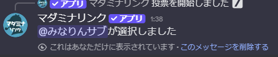

::: tip 通知の有効期限
投票作成から15分を過ぎると、この通知が届かなくなります。投票自体は引き続き可能です。
:::

#### 2. 確認（任意）

「確認」ボタンを押すと、現在の投票状況を確認できます（投票を開始した人のみ）。

<div style="display: flex; gap: 1rem; flex-wrap: wrap; align-items: flex-start;">
  <figure style="flex: 1; min-width: 200px; max-width: 48%; margin: 0; text-align: center;">
    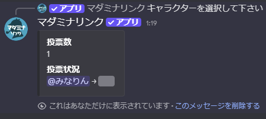
    <figcaption>スポイラー状態</figcaption>
  </figure>
  <figure style="flex: 1; min-width: 200px; max-width: 48%; margin: 0; text-align: center;">
    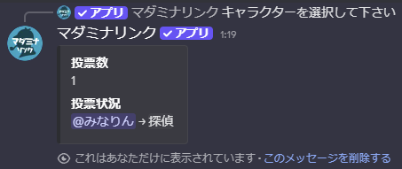
    <figcaption>クリックして表示</figcaption>
  </figure>
</div>

#### 3. 集計

「集計」ボタンを押すと、投票が締め切られ結果がチャンネルに公開されます（投票を開始した人のみ）。

### 集計結果

#### 重複なしの場合

全員が異なる選択肢を選んだ場合、自動で以下の処理が行われます。

- 選択したキャラクター名にニックネームが変更される
- 選択肢にロールを指定していた場合、そのロールが付与される

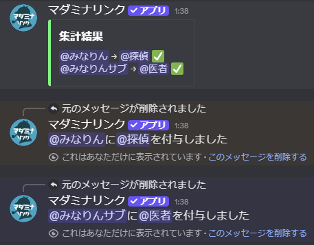

#### 重複ありの場合

複数人が同じ選択肢を選んだ場合、警告（⚠️）が表示され「再投票」ボタンが表示されます。

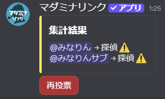

「再投票」ボタンを押すと、重複している選択肢のみで再投票を開始できます。

### ロールを選択肢に使用

選択肢にロールをメンションすると、集計時に自動でロールが付与されます。

```
/poll 投票モード:キャラ選択 選択肢:@探偵 @医者 @執事 @令嬢
```

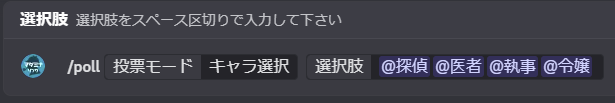

## 犯人投票

### 使用方法

```
/poll 投票モード:犯人投票 選択肢:探偵 医者 執事 令嬢
```

キャラ選択と同様に、選択肢ごとのボタンと「確認」「集計」ボタンが表示されます。

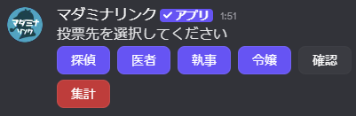

### 投票の流れ

投票と確認の流れはキャラ選択と同じです。

### 集計結果

集計結果は投票を開始した人にのみ表示されます（プレイヤーには見えません）。

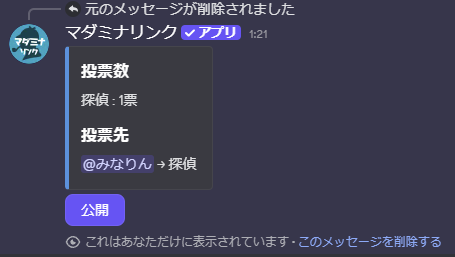

- 得票数順に選択肢が表示される
- 誰が何に投票したかが表示される
- 「全体に公開」ボタンで結果をチャンネルに公開できる

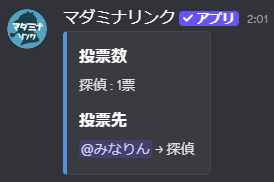

#### 決選投票

最多得票が2つ以上ある場合、「決選投票」ボタンが表示されます。

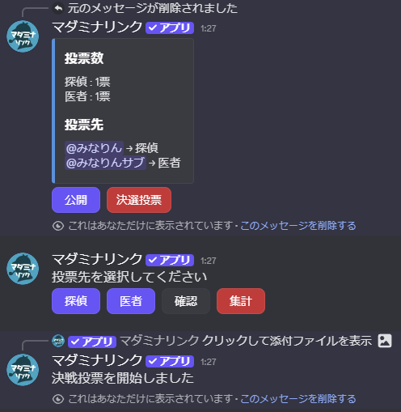

「決選投票」ボタンを押すと、同率1位の選択肢のみで再度投票を開始できます。

## オプション

| オプション | 必須 | 説明 |
|-----------|------|------|
| 投票モード | はい | 「キャラ選択」または「犯人投票」 |
| 選択肢 | はい | 選択肢をスペース区切りで入力 |

### 投票モードの詳細

| モード | 集計結果の公開 | 自動処理 |
|--------|--------------|----------|
| キャラ選択 | 全員に公開 | ニックネーム変更、ロール付与 |
| 犯人投票 | 投票開始者のみ | なし（手動で公開可能） |

### 選択肢の詳細

- **区切り文字**: スペース、全角スペース、カンマ（`,`）、読点（`、`）
- **ロールの使用**: ロールをメンションすると、ロール名が選択肢として表示される

::: warning 選択肢の制限
- 選択肢は最大23個まで設定できます
- 各選択肢は最大50文字までです（ロールを指定した場合はロール名の長さに関わらず設定可能）
:::

::: warning 投票人数の上限
- キャラ選択: 最大50人まで参加可能
- 犯人投票: 最大25人まで参加可能
:::

