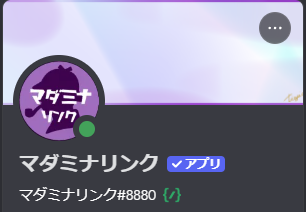
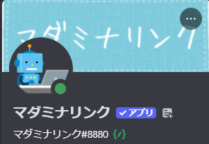

<PageHeader />

## 使用方法

### プロフィールを設定する（set）

```
/profile set
```

モーダルが表示され、以下の項目を設定できます。

- **アバター画像**: サーバー内でのBotアイコン
- **バナー画像**: Botのプロフィールバナー
- **ニックネーム**: サーバー内でのBot表示名（最大32文字）


::: warning ファイルの制限
画像ファイル（PNG、JPGなど）のみ対応しています。それ以外の形式をアップロードするとエラーになります。また、ファイルサイズは10MB以下である必要があります。
:::

::: warning 変更間隔の制限
アバターやバナーを短時間に連続して変更すると、レート制限によりエラーになります。しばらく待ってから再度お試しください。
:::

#### 変更例

<div style="display: flex; gap: 1rem; flex-wrap: wrap; align-items: flex-start;">
  <figure style="flex: 1; min-width: 200px; max-width: 32%; margin: 0; text-align: center;">
    
  </figure>
  <figure style="flex: 1; min-width: 200px; max-width: 32%; margin: 0; text-align: center;">
    
  </figure>
  <figure style="flex: 1; min-width: 200px; max-width: 32%; margin: 0; text-align: center;">
    
  </figure>
</div>

### プロフィールをリセットする（reset）

```
/profile reset
```

設定したニックネーム、アバター、バナーをすべてリセットし、デフォルトの状態に戻します。

::: tip 画像の扱い
アバター・バナーは新たにアップロードしなければ変更されません。
:::

## 用途

### セッションの雰囲気に合わせたアバター変更

シナリオの世界観やテーマに合わせてBotのアバター・バナーを変更できます。

1. `/profile set` を実行
2. モーダルでテーマに合った画像をアップロード
3. セッション終了後は `/profile reset` で元に戻す

### サーバーごとに異なるアバターを設定

複数のサーバーでBotを使用している場合、サーバーごとに異なるアバターを設定できます。各サーバーで `/profile set` を実行し、それぞれのサーバーに合った画像を設定してください。
