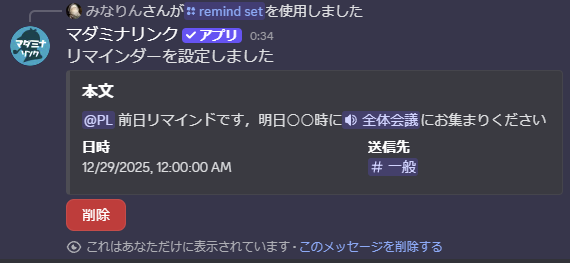
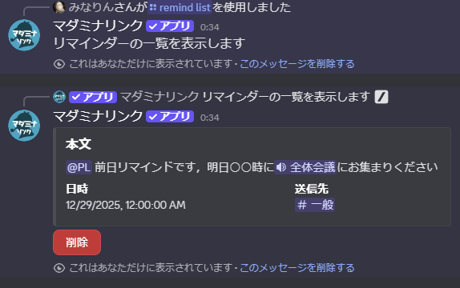

<PageHeader />

## 使用方法

### リマインダーを登録する（set）

```
/remind set 月:12 日:25 時:20 分:0 本文:セッション開始です
```

実行すると、指定した日時にメッセージを送信するリマインダーが登録されます。登録後、本文・日時・送信先が埋め込みで表示され、削除ボタンが付きます。



指定した日時になると、送信先チャンネルにメッセージが自動送信されます。


### 登録済みのリマインダーを確認する（list）

```
/remind list
```

自分が登録したリマインダーの一覧が表示されます。各リマインダーに削除ボタンが付いており、不要なものを削除できます。内容を変更したい場合は、一度削除してから再度 `/remind set` で登録してください。



::: tip
一覧には、すべてのサーバーで登録したリマインダーが表示されます。
:::

## オプション（set）

| オプション | 必須 | 説明 |
|-----------|------|------|
| 月 | はい | 送信する月（1〜12） |
| 日 | はい | 送信する日（1〜31） |
| 時 | はい | 送信する時（0〜23） |
| 分 | はい | 送信する分（0〜59） |
| 本文 | はい | 送信するメッセージ内容 |
| 送信先 | いいえ | 送信先チャンネル |

### オプションの詳細

#### 月・日・時・分

リマインダーを送信する日時を指定します。

::: warning 設定可能な期間
過去の日付を指定した場合は自動的に翌年に設定されます。現在から3ヶ月以内の日付のみ設定可能です。
:::

#### 本文

送信するメッセージ内容を入力します。

- **メンション**: `@ロール名` や `@ユーザー名` を含めると、送信時にメンションされます
- **改行**: 以下のいずれかで改行できます
  - `\n`（バックスラッシュとn）
  - 半角スペース2つ
  - 全角スペース2つ

#### 送信先

リマインダーを送信するチャンネルを指定します。

- **デフォルト**: コマンドを実行したチャンネル
- **指定可能な対象**: テキストチャンネル、アナウンスチャンネル

## 使用例

### 基本的な使い方

```
/remind set 月:12 日:25 時:20 分:0 本文:セッション開始です
```

12月25日 20:00にメッセージが送信されます。

### メンションを含める

```
/remind set 月:12 日:24 時:12 分:0 本文:@PL 明日20時からセッションです
```

ロールへのメンションを含めることで、参加者に通知できます。

### 送信先を指定

```
/remind set 月:12 日:25 時:20 分:0 本文:セッション開始です 送信先:#告知
```

指定したチャンネルにリマインダーを送信します。

### 複数行のメッセージ

```
/remind set 月:12 日:25 時:19 分:30 本文:セッション開始30分前です  準備をお願いします
```

半角スペース2つで改行を含めることができます。

## 用途

### ケース1: セッション直前のリマインド

セッション開始前に参加者へ通知を送ります。

1. `/remind set` でセッション開始時刻にリマインダーを設定
2. 本文にロールへのメンションを含める
3. 指定日時に自動でメッセージが送信される

### ケース2: 前日の事前告知

セッション前日に参加者へ確認の通知を送ります。

1. `/remind set` でセッション前日の適切な時間にリマインダーを設定
2. 開始時刻や準備事項を本文に記載
3. 参加者が事前に確認できる

### ケース3: 締め切りのリマインド

卓募集の締め切りなど、特定のタイミングで告知を送ります。

1. `/remind set` で締め切り日時にリマインダーを設定
2. 該当チャンネルを送信先に指定
3. 締め切り時に自動で告知される
