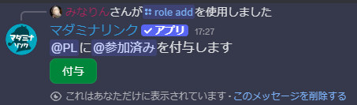
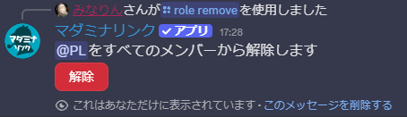
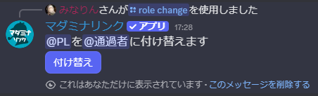
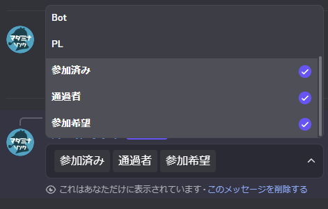

<PageHeader />

## 使用方法

### ロールを付与する（add）

```
/role add 対象:@PL 付与するロール:@参加済み
```

対象のロールを持つメンバーに別のロールを付与するボタンを作成します。



### ロールを解除する（remove）

```
/role remove 解除するロール:@PL
```

選択したロールをすべてのメンバーから解除するボタンを作成します。



### ロールを付け替える（change）

```
/role change 解除するロール:@PL 付与するロール:@通過者
```

ロールを別のロールに付け替えるボタンを作成します。



### ロール取得ボタンを設置する（self）

```
/role self 付与するロール:@参加希望
```

ロールの取得・解除を行うボタンを設置します。


ロールを指定せずに実行すると、サーバーのロール一覧が表示され、一括でボタンを作成できます。

```
/role self
```



::: warning ロール操作の制限
マダミナリンクより上位のロールは操作できません。詳しくは[ロールの並び替え](/guide/getting-started#_1-ロールの並び替え)を参照してください。
:::


## 用途

### 参加者全員にロールを付与（add）

1. `/role add 対象:@PL 付与するロール:@参加済み` を実行
2. ボタンを押すと、PLロールを持つ全員に「参加済み」ロールが付与される
3. 既存のPLロールはそのまま残る

### セッション終了時のロール一括解除（remove）

1. `/role remove 解除するロール:@PL` を実行
2. セッション終了時にボタンを押す
3. 全メンバーからPLロールが解除される

### セッション終了時のロール変更（change）

1. `/role change` でPLロール→通過者ロールのボタンを作成
2. セッション終了時にボタンを押す
3. 全PLのロールが一括で変更される

### 参加希望の受付（self）

1. `/role self 付与するロール:@参加希望` を実行
2. 参加希望者がボタンを押してロールを取得
3. GMが参加者を把握できる

### 通過済みシナリオの自己申告（self）

1. `/role self 付与するロール:@〇〇シナリオ通過者` を実行
2. 該当シナリオを通過済みのメンバーが自分でロールを取得
3. ネタバレ防止チャンネルへのアクセス管理に活用できる

## オプション

### add

| オプション | 必須 | 説明 |
|-----------|------|------|
| 対象 | はい | ロールを付与する対象のロール |
| 付与するロール | はい | 付与するロール |
| ボタンを他の人からも見えるようにする | いいえ | 「はい」にすると永続的なボタンになります |

### remove

| オプション | 必須 | 説明 |
|-----------|------|------|
| 解除するロール | はい | 解除するロール |
| ボタンを他の人からも見えるようにする | いいえ | 「はい」にすると永続的なボタンになります |

### change

| オプション | 必須 | 説明 |
|-----------|------|------|
| 解除するロール | はい | 解除するロール |
| 付与するロール | はい | 付与するロール |
| ボタンを他の人からも見えるようにする | いいえ | 「はい」にすると永続的なボタンになります |

### self

| オプション | 必須 | 説明 |
|-----------|------|------|
| 付与するロール | いいえ | ロール取得ボタンを作成するロール。省略するとロール一覧から選択 |

### オプションの詳細

#### ボタンを他の人からも見えるようにする

ボタンの公開範囲を設定します。

- **いいえ（デフォルト）**: 自分だけに表示される一時的なボタン。Discordを閉じると消えます
- **はい**: 全員に表示される永続的なボタン。Discordを閉じても残り続け、`/copy` で複製も可能です

::: warning 注意
「はい」を選択した場合、誰でもボタンを押せるようになります。設置するチャンネルに注意してください。
:::
