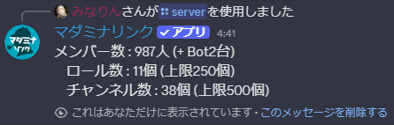

<PageHeader />

## 使用方法

```
/server
```

実行すると、サーバーのリソース状況が表示されます。



## 表示される情報

| 項目 | 説明 | 上限 |
|------|------|------|
| メンバー数 | 人間のメンバー数とBotの台数を別々に表示 | - |
| ロール数 | サーバー内のロール総数 | 250個 |
| チャンネル数 | サーバー内のチャンネル総数 | 500個 |

表示例：

```
メンバー数 : 15人 (+ Bot3台)
ロール数 : 42個 (上限250個)
チャンネル数 : 87個 (上限500個)
```

::: warning レート制限
短時間に何度も実行すると、Discordのレート制限により一時的にエラーになることがあります。その場合は時間をおいて再度実行してください。
:::

## 用途

### リソース上限の確認

[/setup](/commands/setup) や [/copy](/commands/copy) でカテゴリを作成する前に、チャンネル数やロール数が上限に近づいていないか確認できます。

::: tip 上限に近い場合
[/delete](/commands/delete) で不要なカテゴリを削除することで、チャンネル数とロール数を減らせます。
:::
