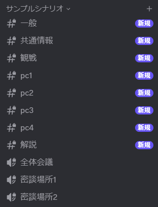
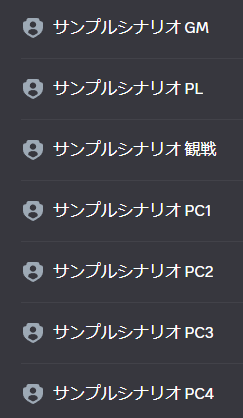
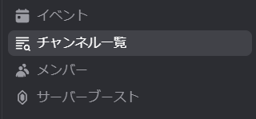

<PageHeader />

## 使用方法

```
/setup シナリオ名:サンプルシナリオ プレイヤー数:4 密談チャンネル数:2
```

実行すると、以下のようにチャンネルとロールが作成されます。

<div style="display: flex; gap: 1rem; flex-wrap: wrap; align-items: flex-start; justify-content: center;">
  <figure style="margin: 0; display: inline-block;">
    
    <figcaption>作成されるチャンネル</figcaption>
  </figure>
  <figure style="margin: 0; display: inline-block;">
    
    <figcaption>作成されるロール</figcaption>
  </figure>
</div>

## 作成されるもの

### チャンネル構成

シナリオ名のカテゴリ内に以下のチャンネルが作成されます。

| 種別 | チャンネル名 | 用途 |
|------|-------------|------|
| テキスト | 一般 | 連絡・雑談 |
| テキスト | 共通情報 | シナリオ概要・ルール |
| テキスト | pc1, pc2, ... | 各プレイヤー専用 |
| テキスト | 観戦 | 観戦者専用 |
| テキスト | 解説 | シナリオ解説 |
| ボイス | 全体会議 | 全体での議論 |
| ボイス | 密談場所1, 密談場所2, ... | 少人数での密談 |

### ロール構成

| ロール名 | 説明 |
|----------|------|
| {シナリオ名} GM | ゲームマスター用 |
| {シナリオ名} PL | プレイヤー全員用 |
| {シナリオ名} 観戦 | 観戦者用 |
| {シナリオ名} PC1, PC2, ... | 各プレイヤー個別用 |

### チャンネル権限

- **◯ 読み書き / 発言** : メッセージの送信や発言ができます
- **△ 読むだけ / 聞くだけ** : 閲覧・聴取のみ可能です
- **✕ 見れない** : チャンネルが表示されません

<PermissionTable :permissions="[
  { channel: '一般', gm: 'write', pl: 'write', individualPl: 'write', spectator: 'write' },
  { channel: '共通情報', gm: 'write', pl: 'read', individualPl: 'read', spectator: 'read' },
  { channel: 'pc1, pc2, ...', gm: 'write', pl: 'none', individualPl: 'write', spectator: 'read' },
  { channel: '観戦', gm: 'write', pl: 'none', individualPl: 'none', spectator: 'write' },
  { channel: '解説', gm: 'write', pl: 'none', individualPl: 'none', spectator: 'read' },
  { channel: '全体会議', gm: 'write', pl: 'write', individualPl: 'write', spectator: 'read', isVoice: true },
  { channel: '密談場所, ...', gm: 'write', pl: 'write', individualPl: 'write', spectator: 'read', isVoice: true },
]" />

※ pc1, pc2, ... は自分のチャンネルのみ読み書き可能。他のPCのチャンネルは見れません。

### カテゴリ権限

カテゴリ自体にも権限が設定されています。

| ロール | 権限 |
|--------|------|
| GM | 読み書き可能 |
| PL | 見れない |
| 観戦 | 読むだけ |

PLロールはカテゴリが見えませんが、個別チャンネルの権限で上書きされるため、一般チャンネルなど必要なチャンネルは見ることができます。

::: tip プレイ後の権限整理
カテゴリには「解説」チャンネルと同じ権限（GM: 読み書き、PL: 見れない、観戦: 読むだけ）が設定されています。プレイ終了後に [/sync](/commands/sync) を使うと、すべてのチャンネルがこの権限に統一され、GMと観戦だけがアクセスできる状態になります。
:::

::: warning コミュニティサーバーでカテゴリが表示されない場合
コミュニティサーバーでは新規カテゴリが表示されない場合があります。その場合は「チャンネル一覧」からフォローしてください。


:::

## オプション

| オプション | 必須 | 説明 |
|-----------|------|------|
| シナリオ名 | はい | シナリオ名 |
| プレイヤー数 | はい | プレイヤー数 |
| 密談チャンネル数 | はい | 密談チャンネル数 |
| ロールの作成位置 | いいえ | 指定したロールの下に新規ロール作成します |
| 個別ロールを作成しない | いいえ | 個別のチャンネルは作られますがロールは作成されません |
| キャラ名を指定 | いいえ | キャラクターの名前をスペース区切りで入力してください |

### オプションの詳細

#### シナリオ名（必須）

作成されるカテゴリとロールの名前に使用されます。
- カテゴリ名: そのままシナリオ名が使用されます
- ロール名: 「シナリオ名 GM」「シナリオ名 PL」などの形式で作成されます

#### プレイヤー数（必須）

作成する個別チャンネル・ロールの数を指定します。
- この数だけ pc1, pc2, ... のチャンネルと、対応する個別ロールが作成されます
- **例**: 6を指定すると、pc1〜pc6 のチャンネルと PC1〜PC6 のロールが作成されます

::: warning チャンネル数の上限
カテゴリ内のチャンネル数が50以上、またはサーバー全体のチャンネル数が500個を超える場合はエラーになります。
:::

#### 密談チャンネル数（必須）

作成する密談用ボイスチャンネルの数を指定します。

- この数だけ「密談場所1」「密談場所2」... のボイスチャンネルが作成されます

#### ロールの作成位置

新規ロールを作成する位置を指定できます。指定したロールの直下に作成されます。

- **デフォルト**: 最下部（@everyoneの上）に作成
- **使用例**: 既存のロール階層を維持したい場合に便利です

#### 個別ロールを作成しない

PC1, PC2, ... などの個別ロールを作成しません。GM・PL・観戦のロールは通常通り作成されます。

- **デフォルト**: 作成する（いいえ）
- **作成されるロール**: GM、PL、観戦のみ（個別ロールなし）
- **使用例**: ロール数を節約したい場合や、手動でロールを管理したい場合に便利です

#### キャラ名を指定

PC1, PC2, ... の代わりに任意のキャラクター名でチャンネル・ロールを作成できます。

- **デフォルト**: PC1, PC2, ...
- **区切り文字**: 半角スペース、全角スペース、カンマ（,）、読点（、）
- **注意**: キャラ名の数はプレイヤー数と一致している必要があります

::: warning サーバー全体のチャンネル上限
サーバー全体のチャンネル数が500個を超える場合はエラーになります。
:::
