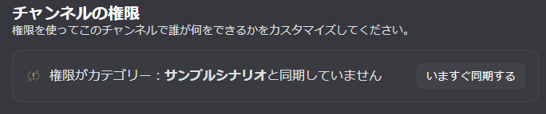

<PageHeader />

## 使用方法

```
/sync 同期するカテゴリ:#カテゴリ名
```

実行すると、指定したカテゴリ内のすべてのチャンネルの権限がカテゴリの権限と同期されます。

<figure style="margin: 0;">
  
  <figcaption>同期前</figcaption>
</figure>

<figure style="margin: 0;">
  
  <figcaption>同期後</figcaption>
</figure>

## 同期の仕組み

各チャンネルには「カテゴリと同期」という設定があります。この設定が有効な場合、チャンネルの権限はカテゴリの権限と同じになります。

`/sync` コマンドは、カテゴリ内のすべてのチャンネルに対してこの「カテゴリと同期」を有効にします。

::: warning 個別の権限設定は上書きされます
チャンネルに個別に設定した権限は、カテゴリの権限で上書きされます。個別の権限を維持したいチャンネルがある場合は、同期前にカテゴリから移動してください。
:::

## オプション

| オプション | 必須 | 説明 |
|-----------|------|------|
| 同期するカテゴリ | はい | 権限を同期するカテゴリ |

### オプションの詳細

#### 同期するカテゴリ（必須）

権限を同期するカテゴリを指定します。

- **指定可能な対象**: カテゴリのみ（テキストチャンネルやボイスチャンネルは指定できません）

## 使用例

### カテゴリ内のチャンネルを同期

```
/sync 同期するカテゴリ:#セッション用
```

「セッション用」カテゴリ内のすべてのチャンネルの権限がカテゴリと同期されます。

## 用途

### ケース1: カテゴリ全体の権限を一括変更

カテゴリの権限を変更した後、すべてのチャンネルに反映させます。

1. カテゴリの権限設定を変更
2. `/sync` を実行
3. カテゴリ内の全チャンネルに権限が反映される

### ケース2: セッション終了時の権限整理

[/setup](/commands/setup) で作成したカテゴリには、GMと観戦のみがアクセスできる権限が設定されています。セッション終了時に `/sync` を実行すると、すべてのチャンネルをこの状態に統一できます。

1. セッションが終了
2. `/sync` を実行
3. すべてのチャンネルがGMと観戦のみアクセス可能な状態になる
