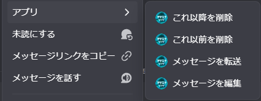
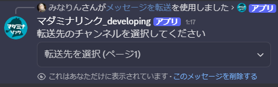

<PageHeader />

## 使用方法

1. 転送したいメッセージを右クリック
2. 「アプリ」→「メッセージを転送」を選択
   
3. 転送先のチャンネルを選択
   
4. メッセージが転送されます

## 転送できる範囲

転送先には、同一カテゴリ内のチャンネルが選択肢として表示されます。カテゴリ外のチャンネルへは転送できません。

::: tip カテゴリに所属していないチャンネルの場合
サーバー内のカテゴリに属さないテキストチャンネルが選択肢として表示されます。
:::

## 用途

### 複数のチャンネルへの同時転送

転送先のチャンネルは複数選択できるため、同じメッセージを一度に複数のチャンネルへ転送できます。

::: tip 転送先の事前設定や複数メッセージの一括転送をしたい場合
[/transfer](/commands/transfer) で転送ボタンを作成すると便利です。
:::

### 誤送信したメッセージの移動

メッセージを正しいチャンネルに素早く移動できます。
