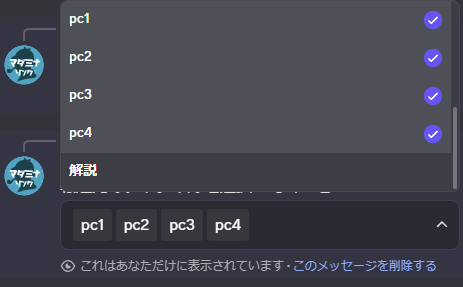
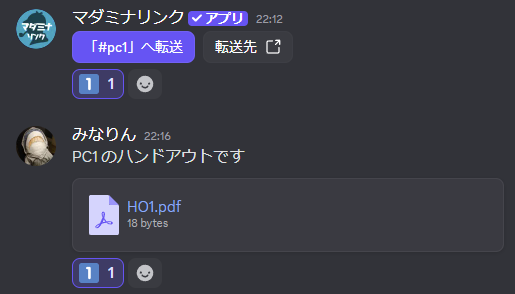

<PageHeader />

## 使用方法

```
/transfer 転送先:#pc1
```

実行すると、指定したチャンネルへの転送ボタンが作成されます。


転送先を指定せずに実行すると、同じカテゴリ内のチャンネルリストが表示され、複数選択できます。選択したチャンネルごとに転送ボタンが作成されます。

```
/transfer
```

::: warning 注意
リストにはコマンドを実行したチャンネルと同じカテゴリ内のチャンネルのみが表示されます。
:::

<div style="display: flex; gap: 1rem; flex-wrap: wrap; align-items: flex-start;">
  <figure style="flex: 1; min-width: 300px; max-width: 48%; margin: 0; text-align: center;">
    
    <figcaption>チャンネル選択リスト</figcaption>
  </figure>
  <figure style="flex: 1; min-width: 300px; max-width: 48%; margin: 0; text-align: center;">
    
    <figcaption>複数の転送ボタン</figcaption>
  </figure>
</div>

## 転送の手順

転送ボタンを使ってメッセージを転送する流れは以下の通りです。

### 1. 転送ボタンを作成し、リアクションをつける

`/transfer` で転送ボタンを作成したら、転送したいメッセージと転送ボタンの両方に同じリアクション（絵文字）をつけます。



::: tip
リアクションには、通常の絵文字だけでなくサーバー専用のカスタム絵文字も使用できます。
:::

### 2. ボタンを押して転送

転送ボタンを押すと、同じリアクションがついたメッセージがすべて転送されます。


### 3. 転送完了

転送先のチャンネルにメッセージがコピーされます。


## 転送される内容

以下の内容が転送先のチャンネルにコピーされます。

| 項目 | 転送される内容 |
|------|---------------|
| メッセージ | テキストメッセージ、埋め込み、添付ファイル（10MB以下） |
| スレッド | スレッドとその中のメッセージ |
| ピン留め | 転送元でピン留めされていた場合、転送先でもピン留めされる |

::: warning ファイルサイズの上限
10MBを超えるファイルは転送されず、エラーメッセージが表示されます。
:::

::: warning スレッドへの転送
転送先にスレッドを指定できますが、クローズされたスレッドは転送先の候補に表示されず、転送できません。クローズされたスレッドに転送したい場合は、事前に「スレッドを開く」を行う必要があります。
:::

## オプション

| オプション | 必須 | 説明 |
|-----------|------|------|
| 転送先 | いいえ | 転送先のチャンネル（指定しない場合はリストから選択） |

### オプションの詳細

#### 転送先

転送先のチャンネルを指定します。

- **デフォルト**: 未指定の場合、同じカテゴリ内のチャンネルリストから複数選択可能
- **指定可能な対象**: テキストチャンネル、アナウンスチャンネル、スレッドチャンネル

## 使用例

### ケース1: 個別情報の配布

GMが各プレイヤーごとに異なる情報を配布します。

1. GMチャンネルに各プレイヤーの個別情報を用意
2. `/transfer` で各個別チャンネル（pc1, pc2...）への転送ボタンを作成
3. 該当する情報にリアクションをつけてボタンで転送

**配布例**: 個別ハンドアウト、PC専用の手がかり、キャラクター固有の秘密，投票テンプレート

### ケース2: 共通資料の一括配布

GMが複数のプレイヤーに同じ情報を配布します。

1. GMチャンネルに配布する資料を用意
2. `/transfer` で複数のチャンネルを選択して転送ボタンを作成
3. リアクションをつけて一括転送

**配布例**: シナリオPDF、共通ハンドアウト、ルール説明、マップ画像

**配布先**: 各個別チャンネル（pc1, pc2...）や共通情報チャンネルなど
