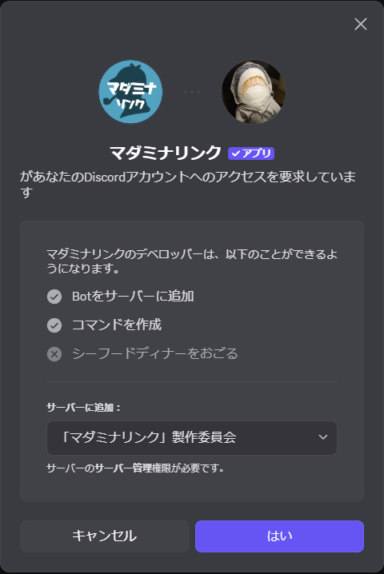
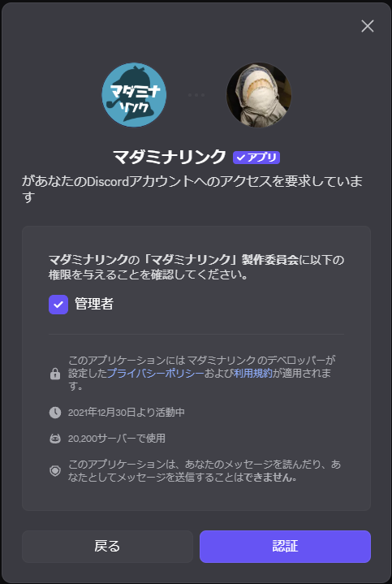
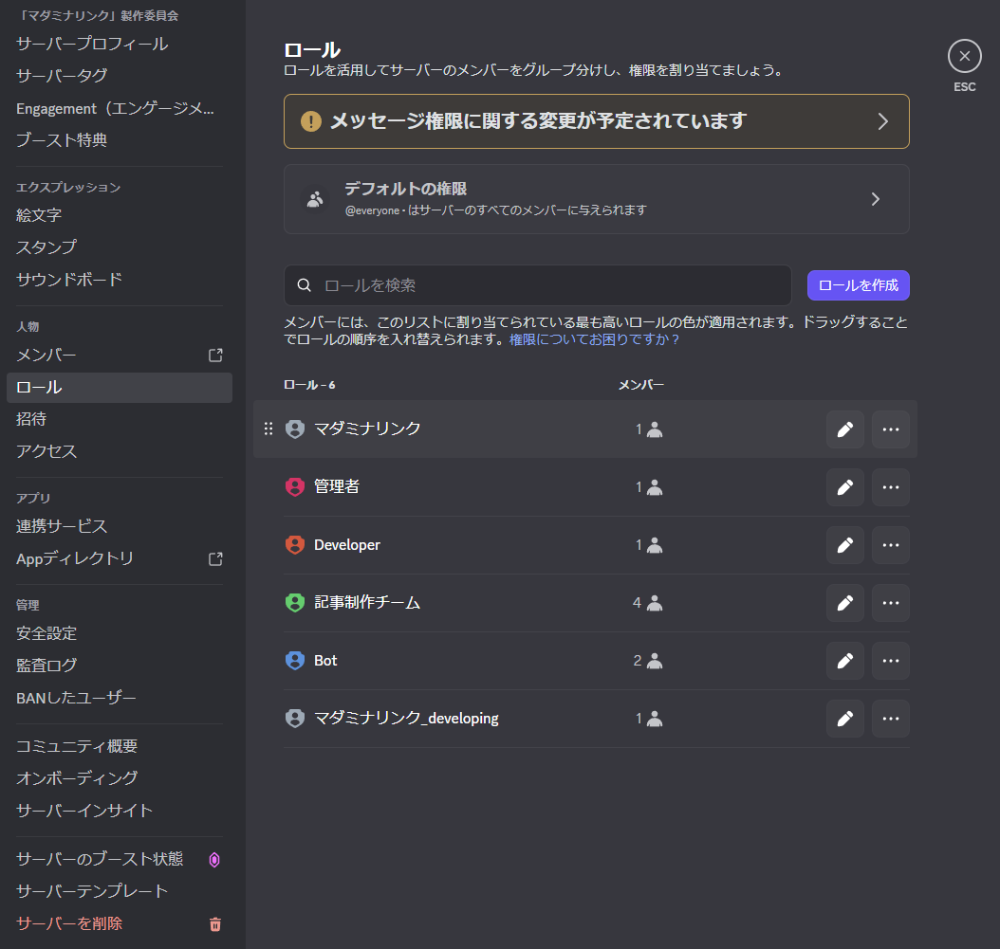
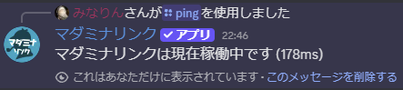

<PageHeader />

## Botの招待

以下のリンクからマダミナリンクをサーバーに招待できます。

[Botを招待する](https://discord.com/api/oauth2/authorize?client_id=926051893728403486&permissions=8&scope=bot%20applications.commands)

::: tip 2回目以降の招待
すでに他のサーバーでマダミナリンクを使用している場合は、Botのプロフィール画面から「アプリを追加」を押すことでも追加できます。
:::

<div style="display: flex; gap: 1rem; flex-wrap: wrap; align-items: flex-start;">
  
  
</div>

::: warning 推奨権限
マダミナリンクは**管理者権限の付与を推奨**しています。これは以下の機能を実行するためです：
- チャンネル・カテゴリーの作成・削除
- ロールの作成・編集
- メッセージの削除・管理
- メンバーのニックネーム変更

管理者権限なしで運用することも可能ですが、その場合は上記の個別権限を適切に設定・管理する必要があります。  
権限設定は自己責任でお願いします。
:::

## 初期設定

### 1. ロールの並び替え

Botを招待したら、サーバー設定からロールの順序を調整してください。

::: tip 重要
Discordではロールの順番が上にあるほど上位のロールになります。マダミナリンクを招待した時点では一番下になっているため、操作対象とするロール（プレイヤーロールなど）よりも**上位**に配置する必要があります。
:::

1. サーバー設定を開く
2. 「ロール」タブを選択
3. マダミナリンクのロールを操作したいロールより上にドラッグ


### 2. スラッシュコマンドの動作確認

マダミナリンクはDiscordの**スラッシュコマンド**という機能を利用して操作します。チャット欄に `/`（スラッシュ）に続けてコマンド名を入力することでコマンドを使用できます。

::: warning 注意
`\`（バックスラッシュ）では反応しないのでご注意ください。
:::

適当なテキストチャンネルで `/ping` コマンドを実行して、Botが正しく動作しているか確認してください。

```
/ping
```


「マダミナリンクは現在稼働中です」というメッセージが返ってくれば、正常に動作しています。



## 基本的な流れ

1. **Botを招待** - 招待リンクからサーバーに追加
2. **ロールを並び替え** - マダミナリンクのロールを適切な位置に配置
3. **動作確認** - `/ping` で応答を確認
4. **セットアップ実行** - `/setup` でプレイ用カテゴリーを作成
5. **ゲームを進行** - 各種コマンドでGM作業をサポート
6. **ログを保存** - `/archive` でプレイログを保存
7. **後片付け** - `/delete` や `/cleanup` で不要なチャンネルを整理

## 次のステップ

導入が完了したら、以下のページで各機能の詳細を確認できます。

- [コマンド一覧](/commands/) - 利用可能なコマンドを確認
- [/setup の使い方](/commands/setup) - セットアップコマンドの詳細

## サポート

上記の手順を試しても解決しない問題があれば、気軽にサポートサーバーでご相談ください。

- [サポートサーバー](https://discord.gg/JMqcQstFSK)

::: tip アップデート情報
アップデート情報や障害状況は[公式X (@Madaminalink)](https://x.com/Madaminalink)で配信しています。
:::
